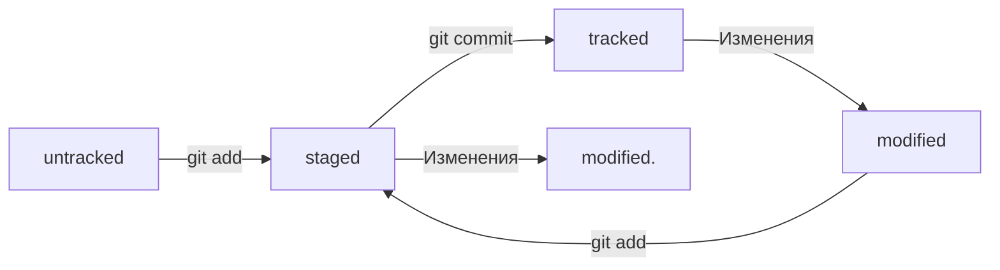

# Практическая работа 1
# В данном ридми файле будет краткий конспект по настройке и работе с git и github
## 01 Настройка окружения и знакомство с командной строкой
### В данной теме почти весь материал посвящён настройке git на PC. Основным знанием данной темы является [шпаргалка](https://practicum.yandex.ru/trainer/git-basics/lesson/fe0bcd71-f592-423b-bb81-27c37a6a115b/ "Базовые команды git") в пятом пункте.
## Тема 1 Введение.
### Краткое содержание модуля:
 - создадим Git-репозиторий, добавим в него файлы и сделаем свой первый коммит;
 - познакомимся с GitHub — самой популярной платформой для хранения IT-проектов и командной работы над ними;
 - научимся синхронизировать локальный репозиторий, который хранится у нас на компьютере, с удалённым — тем, который я заведу на GitHub;
 - изучим понятия хеш, лог, HEAD и другие — они помогут вам ориентироваться в коммитах;
узнаем, как работать с изменениями и правильно оформлять коммиты.

## Тема 2 Первый коммит.
### Ключевые слова для первого коммита
#### git init, git add, git status, git commit -m, git push, git log.
 
## Тема 3 Работа с GitHub.
### Что такое GitHub GitHub — платформа для хранения IT-проектов и совместной работы над ними с использованием Git. По сути, это сайт, куда можно загрузить файлы своего проекта для обмена с другими людьми. Далее идёт подробная инструкция для регистрации и установки соединения с удалённым репозиторием.

### Файл README.md используется для создания описание для ваших проектов на github.(Данную работы я также выполняю в файле формата md для наглядности). Также используя шпаргалку из данного урока - [ссылка](https://practicum.yandex.ru/trainer/git-basics/lesson/c6b9607c-e8bc-4446-89f9-c74522c3492f/ "Шпаргалка по readme")
### В теме три также проходит знакомство с командной строкой и установка Git Bash на PC. 
### Основные операции с файлами через командную строку:
- touch для создания файла(формат файла указывается после его названия через точку)
- mkdir для создания директории
- cp позволит копировать файлы($ cp что_копируем куда_копируем)
- mv вырезает файл(синтаксис аналогичен cp)
- cat вводится, чтобы прочитать файл($ cat myfile.txt # распечатали содержимое файла myfile.txt)
- rm, rmdir, rm -r данные команды используются для удаления файлов и папок(rm удаляет файл, rmdir - папку, rm -r удалит папку со всеми элементами внутри)
### Эффективная работа с командной строкой показана в заключительном уроке темы 3
### Выполнение нескольких команд в одну строку выполняется через разделение двумя амперсандами
### Использование собственной памяти терминала(буфера) осуществляется нажатием на клавиатуре стрелки вверх
### С помощью tab происходит автозаполнение(позволяет не заучивать все команды и сокращать заполнения путей)
### Команды для быстрой навигации и другие базовые команды консоли содержатся в уроке 5 вот [ссылка](https://practicum.yandex.ru/trainer/git-basics/lesson/fe0bcd71-f592-423b-bb81-27c37a6a115b/ "Шпаргался по базовой работе с консолью") для удобства.
## Тема 4 Синхронизация репозиториев.
### Основные команды:
- git init инициализирует папку в репозиторий
- git status показывает текущие состояние репозитория
- git add позволяют "отслеживать" изменённые файлы(git add . - сразу все файлы)
- git commit(git commit -m, если нужно присвоить коммиту название)
- git log позволяет вывести историю коммитов

## Знакомство с GitHub
### GitHub — платформа для хранения IT-проектов и совместной работы над ними с использованием Git.
### Далее в теме 4 урок 1-3 показано создание и привязка к GitHub профилю SSH ключа.
### Команды работы с удалённым репозиторием:
- git push позволяет отправить изменения на удалённый репозиторий
- git pull скачивает изменения с удалённого репозитория
### В пятом уроке мы подходим к функционалу и полезному применению файла README.md и практическому его использованию в уроке 6

# Практическая работа 2
# Навигация по коммитам. Статусы файлов
## Урок 1. Хеш — идентификатор коммита
### Хеширование — это способ преобразовать набор данных и получить их «отпечаток» (англ. fingerprint). Информация о коммите — это набор данных: когда был сделан коммит, содержимое файлов в репозитории на момент коммита и ссылка на предыдущий, или родительский (англ. parent), коммит.
### Git хранит таблицу соответствий хеш → информация о коммите. Если вы знаете хеш, вы можете узнать всё остальное: автора и дату коммита и содержимое закоммиченных файлов. Можно сказать, что хеш — основной идентификатор коммита. Все хеши и таблицу хеш → информация о коммите Git сохраняет в служебные файлы. Они находятся в скрытой папке .git в репозитории проекта.
## Урок 2. Исследуем лог
### После вызова git log появляется список коммитов.
### Элементы, из которых состоит описание:
- строка из цифр и латинских букв после слова commit — это хеш коммита;
- Author — имя автора и его электронная почта;
- Date — дата и время создания коммита;
- в конце находится сообщение коммита.
### Получить сокращённый лог можно с помощью команды git log с флагом --oneline. 
## Урок 3. HEAD — всему голова
### Файл HEAD (англ. «голова», «головной») — один из служебных файлов папки .git. Он указывает на коммит, который сделан последним (то есть на самый новый). Внутри HEAD — ссылка на служебный файл: refs/heads/master (или refs/heads/main в зависимости от названия ветки). Если заглянуть в этот файл, можно увидеть хеш последнего коммита.
## Урок 4. Статусы файлов в Git
### Одна из ключевых задач Git — отслеживать изменения файлов в репозитории. Для этого каждый файл помечается каким-либо статусом. Рассмотрим основные:
- untracked (англ. «неотслеживаемый») Новые файлы в Git-репозитории помечаются как untracked, то есть неотслеживаемые. Git «видит», что такой файл существует, но не следит за изменениями в нём;
- staged (англ. «подготовленный») После выполнения команды git add файл попадает в staging area;
- tracked (англ. «отслеживаемый») В него попадают файлы, которые уже были зафиксированы с помощью git commit, а также файлы, которые были добавлены в staging area командой git add;
- modified (англ. «изменённый») означает, что Git сравнил содержимое файла с последней сохранённой версией и нашёл отличия.
### Типичный жизненный цикл файла в Git

## Урок 5. Как читать git status
###  git status показывает только следующие состояния файлов:
- staged (Changes to be committed в выводе git status);
- modified (Changes not staged for commit);
- untracked (Untracked files).
### Команда git status всегда подскажет, что происходит с файлом: например, он добавлен в список «на коммит» или ещё вообще не отслеживается, или изменён. git status показывает явно следующие состояния файлов: untracked, staged и modified.
